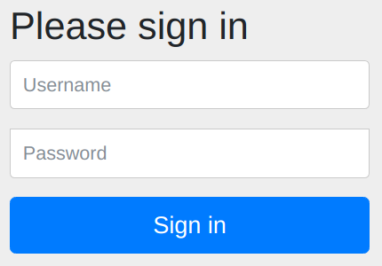

= Adding Spring Security

Adding Spring Security to an existing application can be quite a daunting prospect.
Merely adding the required dependencies to your project sets off a chain of events which can break your application and tests.

Maybe you're suddenly shown a login prompt which expects a generated password logged on startup. +
Maybe your tests now get the dreaded `401 Unauthorized`, or subsequently a `403 Forbidden`. +
Maybe you get a `ClassCastException` when trying to use your `Authentication#getPrincipal()`. +
So this should be fun!

We will walk you through adding Spring Security to an existing application,
by explaining what happens when you first add the dependencies, what to do next, and how to fix your tests.

== Context: Leave application
Imagine a Human Resources department that has a small application to track and approve/deny leave requests.
Initially this application was only used from within the HR department, who received requests via phone or email.
You can see the application in this state in link:leaveapp-initial/[leaveapp-initial], along with the current set of application tests.

Now we want to open up this application to all employees, so they can view and file (only their own) leave requests themselves.
Anyone from the HR department can then either approve or deny a leave request, and view all requests.
Up to you to implement these requirements for this small application.

== 0. Verify initial application
Before we make any changes, it's good to get familiar with link:leaveapp-initial/[the leave application] that we will work on.
Look through the code to see there's a single
link:leaveapp-initial/src/main/java/com/jdriven/leaverequest/LeaveRequestController.java[controller],
backed by a link:leaveapp-initial/src/main/java/com/jdriven/leaverequest/LeaveRequestService.java[service],
which connects to a link:leaveapp-initial/src/main/java/com/jdriven/leaverequest/LeaveRequestRepository.java[repository],
to store link:leaveapp-initial/src/main/java/com/jdriven/leaverequest/LeaveRequest.java[LeaveRequest]s.

=== Running the tests
In terms of tests, there's a single link:leaveapp-initial/src/test/java/com/jdriven/leaverequest/LeaveRequestServiceTest.java[test for the service],
and three different ways to test the controller:

1. once link:leaveapp-initial/src/test/java/com/jdriven/leaverequest/LeaveRequestControllerWebMvcTest.java[through @WebMvcTest],
2. once more link:leaveapp-initial/src/test/java/com/jdriven/leaverequest/LeaveRequestControllerSpringBootWebEnvMockTest.java[through @SpringBootTest(webEnvironment = WebEnvironment.MOCK)],
3. and finally link:leaveapp-initial/src/test/java/com/jdriven/leaverequest/LeaveRequestControllerSpringBootWebEnvRandomPortTest.java[through @SpringBootTest(webEnvironment = WebEnvironment.RANDOM_PORT)].

That way, ideally, at least one of these methods will look familiar to what you know from your own projects.

All these tests should already pass on your machine as well, so go ahead and give that a try, either through your IDE,
or using the below command as run from the workshop repository root.

.Run the tests
[source,bash]
----
# ~/workspace/spring-security-workshop $
./mvnw verify --file adding-spring-security/leaveapp-initial/pom.xml
----

=== Running the application
You should also be able to start the application through `LeaveRequestApplication` without any further changes,
either through your IDE, or again, using the below command as run from the workshop repository root.

.Run the application
[source,bash]
----
# ~/workspace/spring-security-workshop $
./mvnw spring-boot:run --file adding-spring-security/leaveapp-initial/pom.xml
----

Once running you can immediately see an empty array of leave requests using this url: http://localhost:8080/view/all.

To populate your application with leave requests, run any of the below `curl` or `HTTPie` commands.

.HTTPie commands to create, view and approve/deny leave requests.
[%collapsible]
====
[source,bash]
----
# Create a leave request for a specific user and time window
http POST ':8080/request/alice?from=2022-08-21&to=2022-09-11'

# View leave requests for employee
http :8080/view/employee/alice

# Approve leave request
http POST :8080/approve/2a37e1b6-d7e3-45fd-8b50-59357425d62e

# Deny leave request
http POST :8080/deny/2a37e1b6-d7e3-45fd-8b50-59357425d62e

# View leave request
http :8080/view/request/2a37e1b6-d7e3-45fd-8b50-59357425d62e

# View all leave requests
http :8080/view/all
----
====

.Curl commands to create, view and approve/deny leave requests.
[%collapsible]
====
[source,bash]
----
# Create a leave request for a specific user and time window
curl -X POST 'http://localhost:8080/request/alice?from=2022-08-21&to=2022-09-11'

# View leave requests for employee
curl http://localhost:8080/view/employee/alice

# Approve leave request
curl -X POST http://localhost:8080/approve/2a37e1b6-d7e3-45fd-8b50-59357425d62e

# Deny leave request
curl -X POST http://localhost:8080/deny/2a37e1b6-d7e3-45fd-8b50-59357425d62e

# View leave request
curl http://localhost:8080/view/request/2a37e1b6-d7e3-45fd-8b50-59357425d62e

# View all leave requests
curl http://localhost:8080/view/all
----
====

All of the above should just work on your machine.
If it did, you're ready to start making changes.

== 1. Adding Spring Security dependency
The first step in adding security to our application is picking the right dependency to add to our project.
However, even figuring out which dependency to add can be difficult these days!

=== Which dependency to add?
Looking at https://start.spring.io/#!type=maven-project&language=java&platformVersion=2.7.0&packaging=jar&jvmVersion=11&groupId=com.example&artifactId=demo&name=demo&description=Demo%20project%20for%20Spring%20Boot&packageName=com.example.demo&dependencies=security,oauth2-client,oauth2-resource-server,okta,data-ldap,azure-active-directory[start.spring.io]
we can see there are already six different dependencies related to Spring Security and/or OAuth2.
In part this is down to a https://spring.io/blog/2019/11/14/spring-security-oauth-2-0-roadmap-update[restructuring of OAuth2 support],
with OAuth2 resource server and client support now https://github.com/spring-projects/spring-security/wiki/OAuth-2.0-Features-Matrix[moved into Spring Security 5.2+].
As of June 1st 2022 the https://spring.io/blog/2022/06/01/spring-security-oauth-reaches-end-of-life[Spring Security OAuth project has reached End-of-Life].

In short we now advise against using the Spring Cloud Starter dependencies, and push towards using Spring Security support for OAuth2.

If your service will act as an OAuth2 resource server, by accepting JSON Web Tokens passed in from a gateway, you can use `spring-boot-starter-oauth2-resource-server`.
We expect this to be the most common form within a micro-services landscape, where a central gateway assumes the OAuth2 client role.
It is also what we will use throughout this blog post, although much of the details below apply to other forms as well.

If your service will act as an OAuth2 client to acquire JSON Web Tokens, you'll most likely want to use `spring-boot-starter-oauth2-client`.

Both starters will provide you with any transitive dependencies you might need for the most common security aspects.

=== What happens when you add the dependency?
Add the below dependency to link:leaveapp-initial/pom.xml[leaveapp-initial/pom.xml].

.oauth2-resource-server dependency snippet.
[source,xml]
----
<dependency>
	<groupId>org.springframework.boot</groupId>
	<artifactId>spring-boot-starter-oauth2-resource-server</artifactId>
</dependency>
----

When you rerun the tests, you will notice all web related tests now fail with either a HTTP `401 Unauthorized` or `403 Forbidden` response, depending on whether it's a `GET` or `POST` request.

When you run `LeaveRequestApplication` as before, and again open http://localhost:8080/view/all in the browser, you are now presented with a login dialog.

.Please sign in

When you open the same endpoint from the commandline you immediately get a `HTTP/1.1 401` response.

We turn to the application logs to find out what happened in our application.
As it turns out, there's a curious new logline from
https://github.com/spring-projects/spring-boot/blob/2.7.x/spring-boot-project/spring-boot-autoconfigure/src/main/java/org/springframework/boot/autoconfigure/security/servlet/UserDetailsServiceAutoConfiguration.java#L89[`UserDetailsServiceAutoConfiguration`]:

.Using generated security password warning
[source,text]
----
WARN UserDetailsServiceAutoConfiguration : 

Using generated security password: 9c991bee-bf35-4970-92ed-e5458d561a73

This generated password is for development use only. Your security configuration must be updated before running your application in production.
----

This auto configuration triggers when no other security configuration has been provided.
It sets up our application with a default user and generated password, as a fallback of sorts.
After all, if you're adding Spring Security to your class path you will want some form of security.
At the very least the log line and dialog serve as a reminder to configure exactly what you want in your application.

== 2. Configure OAuth2 resource server
Since we wish to configure our application to function as an OAuth2 resource server,
we can provide the required configuration to make the generated security password go away.
https://docs.spring.io/spring-security/reference/5.7.1/servlet/oauth2/resource-server/jwt.html[As indicated in the documentation], configuration takes the form of:

.application.yml snippet to configure oauth2 resource server.
[source,yaml]
----
spring:
  security:
    oauth2:
      resourceserver:
        jwt:
          issuer-uri: http://localhost:8090/auth/realms/spring-cloud-gateway-realm
----

Add the above snippet to link:leaveapp-initial/src/main/resources/application.yml[application.yml].

Once added, the application will call out to the configured `issuer-uri` during startup, to configure the `JwtDecoder` through the
https://openid.net/specs/openid-connect-discovery-1_0.html#ProviderConfig[OpenID Provider Configuration Information endpoint] at:
http://localhost:8090/auth/realms/spring-cloud-gateway-realm/.well-known/openid-configuration

But before we launch our application, we first need to ensure the issuer-uri is available, by running Keycloak.

=== Running Keycloak (or WireMock stubs)
During development we will either
link:keycloak/[use Keycloak] or 
link:wiremock/[WireMock] to serve the configured `issuer-uri` endpoint.
WireMock is the easiest one to get working quickly, as it does not require Docker compose;
Keycloak takes some more effort, but can be used for your own projects as well.

Go ahead and run either Keycloak, or the WireMock stubs using the linked instructions.

NOTE: The existing JSON Web Token provided below will only work with the WireMock stubs.

=== Authenticated requests
Next, launch the `LeaveRequestApplication` again, as you did before.

Now, when you open http://localhost:8080/view/all in the browser, you are no longer presented with a login dialog.
Instead, you immediately get a `401 Unauthorized` error response. _"Progress"_!

The `UserDetailsServiceAutoConfiguration` warning about a `generated security password` has disappeared from the logs.
The `UserDetailsServiceAutoConfiguration` from before has instead been replaced by
https://github.com/spring-projects/spring-boot/blob/2.7.x/spring-boot-project/spring-boot-autoconfigure/src/main/java/org/springframework/boot/autoconfigure/security/oauth2/resource/servlet/OAuth2ResourceServerJwtConfiguration.java#L138[`OAuth2ResourceServerJwtConfiguration`],
which has provided us with a `JwtDecoder` to handle incoming tokens.
Unless you provide your own `SecurityFilterChain`, this sets up your application to require a JSON Web Token for each request.

The reason we're now getting `40x` responses, is because our requests lack an `Authorization` header with `Bearer eyJhbGciOiJ...` JSON Web Token.
To solve this, we have to actually pass a Bearer token along with our requests.
Here's a token value to get your requests through with a `HTTP/1.1 20x` response:

.Show full JSON Web Token valid through August 7th 2022.
[%collapsible]
====
  eyJhbGciOiJSUzI1NiIsInR5cCIgOiAiSldUIiwia2lkIiA6ICJRSS1mdW1sLTRyTnBrdVZxWVg0elpuZlRUZW1hSkxoZ183Z0dULTZiSFlVIn0.eyJqdGkiOiI0OWFkZmVlOS02MGEwLTQxMTItOGI1OS1hZWEwOTliYjlmYTIiLCJleHAiOjE2NTk4OTg3NjYsIm5iZiI6MCwiaWF0IjoxNTczNDk4NzY2LCJpc3MiOiJodHRwOi8vbG9jYWxob3N0OjgwOTAvYXV0aC9yZWFsbXMvc3ByaW5nLWNsb3VkLWdhdGV3YXktcmVhbG0iLCJhdWQiOiJhY2NvdW50Iiwic3ViIjoiYWQ4MjRkZmMtNmFmZi00NWEzLWJlOWQtOTU0ZDUwZmJkYjdhIiwidHlwIjoiQmVhcmVyIiwiYXpwIjoic3ByaW5nLWNsb3VkLWdhdGV3YXktY2xpZW50Iiwibm9uY2UiOiJwMGtsejZlc0VYNnYtWU8tXzVGd2JITk95N2NudklibEsweTBiWi1iUVpNIiwiYXV0aF90aW1lIjoxNTczNDk4NzY2LCJzZXNzaW9uX3N0YXRlIjoiZjIyMjY4ZTAtOTJlZS00MDU4LTgzMzctMzkyNDg4YjJlNTQwIiwiYWNyIjoiMSIsInJlYWxtX2FjY2VzcyI6eyJyb2xlcyI6WyJvZmZsaW5lX2FjY2VzcyIsInVtYV9hdXRob3JpemF0aW9uIl19LCJyZXNvdXJjZV9hY2Nlc3MiOnsiYWNjb3VudCI6eyJyb2xlcyI6WyJtYW5hZ2UtYWNjb3VudCIsIm1hbmFnZS1hY2NvdW50LWxpbmtzIiwidmlldy1wcm9maWxlIl19fSwic2NvcGUiOiJvcGVuaWQgcGhvbmUgbWljcm9wcm9maWxlLWp3dCBvZmZsaW5lX2FjY2VzcyBwcm9maWxlIGVtYWlsIGFkZHJlc3MiLCJ1cG4iOiJhbGljZSIsImVtYWlsX3ZlcmlmaWVkIjp0cnVlLCJhZGRyZXNzIjp7fSwibmFtZSI6IkFsaWNlIiwiZ3JvdXBzIjpbIm9mZmxpbmVfYWNjZXNzIiwidW1hX2F1dGhvcml6YXRpb24iXSwicHJlZmVycmVkX3VzZXJuYW1lIjoiYWxpY2UiLCJnaXZlbl9uYW1lIjoiQWxpY2UifQ.hHK8E-01eFb4UZtBjclVronp-6jfVbhxh9U0m0DEdYQE8YGWFCjMxUcfeI0Rx9zueeC_HJsFT4wcegs8Qh6Z2n7IGWbf0Vtg0fzVH9vFXkwbFBdbCZJz4MZ1Zc3cpC2UrSnuPDc8EIn1FQrKIEF8nqEcNzcL3ujxligvOern2A4xUS1GLqrLKmbPPbKocESZb75EMbmEPFDoctgI1n4vniOz9j242WxbcMjM7INeIsPCKWqvgaeYHOKlgW2CfHfsLPr_XQw5VvCMWJ1GHficCwwjyL-PeemHmBS6eO6EnHpl5Ftm7siATcZuJXQHTosb6b38Gkw2s6-yGQJcbQc01g
====

If you're curious what information is contained within this token, you can easily decode the token into it's three parts using https://jwt.io.

.Show decoded JSON Web Token payload.
[%collapsible]
====
[source,json]
----
{
  "jti": "49adfee9-60a0-4112-8b59-aea099bb9fa2",
  "exp": 1659898766,
  "nbf": 0,
  "iat": 1573498766,
  "iss": "http://localhost:8090/auth/realms/spring-cloud-gateway-realm",
  "aud": "account",
  "sub": "ad824dfc-6aff-45a3-be9d-954d50fbdb7a",
  "typ": "Bearer",
  "azp": "spring-cloud-gateway-client",
  "nonce": "p0klz6esEX6v-YO-_5FwbHNOy7cnvIblK0y0bZ-bQZM",
  "auth_time": 1573498766,
  "session_state": "f22268e0-92ee-4058-8337-392488b2e540",
  "acr": "1",
  "realm_access": {
    "roles": [
      "offline_access",
      "uma_authorization"
    ]
  },
  "resource_access": {
    "account": {
      "roles": [
        "manage-account",
        "manage-account-links",
        "view-profile"
      ]
    }
  },
  "scope": "openid phone microprofile-jwt offline_access profile email address",
  "upn": "alice",
  "email_verified": true,
  "address": {},
  "name": "Alice",
  "groups": [
    "offline_access",
    "uma_authorization"
  ],
  "preferred_username": "alice",
  "given_name": "Alice"
}
----
====

The below `HTTPie` and `curl` commands should all produce `20x` responses when both Keycloak (stubs) and `LeaveRequestApplication` are running.

.Requests authenticated through a JSON Web Token.
[source,bash]
----
# Store full token
export token=eyJhbGciOiJ...

# Create a leave request for a specific user and time window
http POST ':8080/request/alice?from=2022-08-21&to=2022-09-11' "Authorization: Bearer ${token}"
curl -X POST -H "Authorization: Bearer ${token}" 'http://localhost:8080/request/alice?from=2022-08-21&to=2022-09-11'

# View all leave requests
http :8080/view/all "Authorization: Bearer ${token}"
curl -H "Authorization: Bearer ${token}" http://localhost:8080/view/all
----

Perfect; our application now at the very least requires a valid JWT for any request.
This covers our authentication needs for now; we will get to authorization at a later stage.

== 3. Fixing the web tests
Now we have an application that requires an OpenID Connect provider on startup, and a valid JWT for any request.
Neither plays well with the tests we have, so we're going to have to fix each of the different test flavors we have.

The leave application has four different types of tests which each use a partial or full Spring application context, to simulate what you might find in an existing application.
They are identified below using the annotation and argument that bootstraps the test application context.
We'll go over each test and the changes needed to make them pass again.

=== Tests using @SpringBootTest(webEnvironment = WebEnvironment.NONE)
Tests not using any web request are not (yet) broken.
But don't worry, we will break these as soon as we add authorization.

=== Tests using @WebMvcTest(controllers = LeaveRequestController.class)
Next up, we want to make `LeaveRequestControllerWebMvcTest` pass again;
We're testing the controller in isolation here, using `@WebMvcTest` together with `MockMvc`.
Running the tests we see `GET` requests now get a `401 Unauthorized` response, while `POST` requests get a `403 Forbidden` response.

- The `401 Unauthorized` response on `GET` requests we get because we're not yet passing an `Authorization: Bearer eyJhbGciOiJ...` header in our tests.
- The `403 Forbidden` response takes a little more diving into; Debug logging through `logging.level.org.springframework.security: DEBUG` points us in the right direction:
[source,text]
----
DEBUG --- [main] o.s.security.web.csrf.CsrfFilter         : Invalid CSRF token found for http://localhost/request/Alice
DEBUG --- [main] o.s.s.w.access.AccessDeniedHandlerImpl   : Responding with 403 status code
----
By default Spring Security adds https://docs.spring.io/spring-security/reference/5.7.1/servlet/exploits/csrf.html[Cross Site Request Forgery] protection for `POST` requests.
This protects our resource server from malicious requests; and it's best not to disable this.
One way to get around this requirement for tests is to add `csrf` tokens to our POST requests, through 
https://docs.spring.io/spring-security/reference/5.7.1/servlet/test/mockmvc/csrf.html[`SecurityMockMvcRequestPostProcessors#csrf()`] from `spring-security-test`.
But if we only do that, we would then get a `401 Unauthorized` response!

So let's look into a proper fix; First, add the `spring-security-test` dependency to the link:leaveapp-initial/pom.xml[leaveapp-initial/pom.xml] file.

.spring-security-test dependency snippet.
[source,xml]
----
<dependency>
	<groupId>org.springframework.security</groupId>
	<artifactId>spring-security-test</artifactId>
	<scope>test</scope> <1>
</dependency>
----
<1> Notice how we use the `test` scope, as this library is only needed on the test classpath.

This library provides us with `SecurityMockMvcRequestPostProcessors#jwt()`, among others,
which we add to our test methods to have them pass a valid JWT along with each request.
https://docs.spring.io/spring-security/reference/5.7.1/servlet/test/mockmvc/oauth2.html#testing-jwt[The JWT can be configured] in a number of different ways.
Update your tests with the callouts seen below.

[source,java]
----
import static org.springframework.security.test.web.servlet.request.SecurityMockMvcRequestPostProcessors.jwt; <1>

...

@Test
void testRequest() throws Exception {
	when(service.request(anyString(), any(), any()))
		.thenReturn(new LeaveRequest("Alice", of(2022, 11, 30), of(2022, 12, 3), PENDING));
	mockmvc.perform(post("/request/{employee}", "Alice")
		.param("from", "2022-11-30")
		.param("to", "2022-12-03")
		.with(jwt())) <2>
		.andExpectAll(
			status().isAccepted(),
			content().contentType(MediaType.APPLICATION_JSON),
			jsonPath("$.employee").value("Alice"),
			jsonPath("$.status").value("PENDING"));
}
----
<1> To keep the tests readable, we will use a static import.
<2> For now, we will use a plain `jwt()` with a `sub` (subject) claim of value `user`. +
Later on, we will set the subject name to `Alice` to match our requests.

Coincidentally, this also already resolves the CSRF issue with POST requests,
as the CsrfFilter is skipped through the `JwtRequestPostProcessor`.
If you repeat this pattern for all test methods and rerun the tests,
you'll find all tests within `LeaveRequestControllerWebMvcTest` pass again!

=== Tests using @SpringBootTest(webEnvironment = WebEnvironment.MOCK)
In short, for now, these tests need the same treatment as we saw with `@WebMvcMock`.
So go ahead and add `jwt()` to the web requests to get these tests working again as well.

=== Tests using @SpringBootTest(webEnvironment = WebEnvironment.RANDOM_PORT)
The most challenging tests to adapt, are the ones using `TestRestTemplate`, mostly as the API makes it cumbersome to add headers.
And even once you manage to add the `Authorization` header successfully to each request, you still have to mock the token handling.

So let's have a look at a complete example, to give you an idea of what's involved.
Here's an unaltered test not yet passing authorization headers.

.Unaltered test to POST new leave request for user Alice.
[source,java]
----
@Test
void testRequest() {
	LocalDate from = of(2022, 11, 30);
	LocalDate to = of(2022, 12, 3);
	ResponseEntity<LeaveRequestDTO> response = restTemplate.postForEntity(
		"/request/{employee}?from={from}&to={to}",
		null, LeaveRequestDTO.class, "Alice", from, to);
	assertThat(response.getStatusCode()).isEqualByComparingTo(ACCEPTED);
	assertThat(response.getHeaders().getContentType()).isEqualByComparingTo(APPLICATION_JSON);
	assertThat(response.getBody().getEmployee()).isEqualTo("Alice");
	assertThat(response.getBody().getFromDate()).isEqualTo(from);
	assertThat(response.getBody().getToDate()).isEqualTo(to);
	assertThat(response.getBody().getStatus()).isEqualByComparingTo(PENDING);
}
----

Next, here's that same test, but now with all the bits and pieces to pass an authorization header, to trigger the JWT handling, which we mock to decode the token.

.Test to POST new leave request for user Alice, with Authorization header.
[source,java]
----
@MockBean
private JwtDecoder jwtDecoder; <1>

@BeforeEach
void beforeEach() {
	when(jwtDecoder.decode(anyString())) <2>
		.thenReturn(Jwt.withTokenValue("token")
			.subject("alice")
			.header("alg", "none")
			.build());
}

@Test
void testRequest() throws Exception {
	HttpHeaders headers = new HttpHeaders();
	headers.setBearerAuth("some.random.token"); <3>
	HttpEntity<?> httpEntity = new HttpEntity<>(headers); <4>
	
	LocalDate from = of(2022, 11, 30);
	LocalDate to = of(2022, 12, 3);
	ResponseEntity<LeaveRequestDTO> response = restTemplate.exchange( <5>
		"/request/{employee}?from={from}&to={to}",
		HttpMethod.POST, httpEntity, LeaveRequestDTO.class, "alice", from, to);
	assertThat(response.getStatusCode()).isEqualByComparingTo(ACCEPTED);
	assertThat(response.getHeaders().getContentType()).isEqualByComparingTo(APPLICATION_JSON);
	assertThat(response.getBody().getEmployee()).isEqualTo("alice");
	assertThat(response.getBody().getFromDate()).isEqualTo(from);
	assertThat(response.getBody().getToDate()).isEqualTo(to);
	assertThat(response.getBody().getStatus()).isEqualByComparingTo(PENDING);
}
----
<1> We provide a `@MockBean JwtDecoder` to https://docs.spring.io/spring-security/reference/5.7.1/servlet/test/mockmvc/oauth2.html#_authentication_requestpostprocessor[prevent the deferred JWT decoder initialization] from triggering once a JWT is passed in. +
If we do not add the mock bean, the application will call out to the `issuer-uri` upon receiving the first `Authorization` header.
And hosting a OIDC server for your tests is just not feasible or desirable.
<2> We mock the `JwtDecoder.decode(String)` to always return the same `Jwt` value. +
The response should match your actually decoded tokens, which can be hard to keep in sync.
<3> We provide a dummy value for the `Authorization: Bearer` header. +
This ensures the JWT handling is triggered, to decode the dummy value.
<4> We wrap the headers into a `HttpEntity`.
<5> We switch from `TestRestTemplate.postForEntity(...)` to `TestRestTemplate.exchange(...)`, as needed to pass the header.

As you can see, this quickly becomes cumbersome, even when common elements are extracted out into methods.
Have a look at the reference implementation to see https://github.com/timtebeek/spring-security-samples/blob/main/adding-spring-security/leaveapp-complete/src/test/java/com/jdriven/leaverequest/LeaveRequestControllerSpringBootWebEnvRandomPortTest.java#L69[the complete converted test].

There's little value in converting all these tests by hand; just know that it can be done, but try to limit or avoid these types of tests.
You might want to get some practice if these types of tests are common in your application, but otherwise feel free to delete the test, or copy the complete sample.

== 4. Adding authorization
Our application now requires a JWT with every request, and decodes that into an Authentication object.
While this is all fine and needed; it does not yet achieve much in terms of security;
anyone can authenticate, file and view leave requests and approve or deny them as they see fit.
We need to configure our application with some common sense roles and restrictions.
For instance:

- we want users to only submit and view requests for themselves;
- only HR employees can approve or deny requests, and view all requests.

=== Configuring method security
Since all requests pass through link:leaveapp-initial/src/main/java/com/jdriven/leaverequest/LeaveRequestService.java[`LeaveRequestService`], this seems like the perfect place to add our security restrictions.
We'll add a variety of security annotation and expressions, all of which are documented extensively in 
https://docs.spring.io/spring-security/reference/5.7.1/servlet/authorization/method-security.html[the Authorization chapter of Spring Security].

The security annotation handling needs to be enabled through `@EnableMethodSecurity(jsr250Enabled = true)`,
as without this annotation the security annotations will not enforce anything!

NOTE: Previously one might have used `@EnableGlobalMethodSecurity`, but this has been simplified as of Spring Security 5.6.

Add the annotation to a new configuration class.
The class itself does not have to be annotated with `@Configuration`, as `@EnableMethodSecurity` is already meta-annotated.

.Enable method security through a new configuration class.
[source,java]
----
@EnableMethodSecurity(jsr250Enabled = true)
public class MethodSecurityConfig {
	// ...
}
----

=== Require HR role
The easiest methods to secure are the ones that are only accessible to users with the `HR` role.
For this we will use the `@javax.annotation.security.RolesAllowed` annotation, with an argument value of `HR`.

Go ahead and add these annotations to link:leaveapp-initial/src/main/java/com/jdriven/leaverequest/LeaveRequestService.java[`LeaveRequestService`] now.

[source,java]
----
@RolesAllowed("HR")
public Optional<LeaveRequest> approve(UUID id) {
	Optional<LeaveRequest> found = repo.findById(id);
	found.ifPresent(lr -> lr.setStatus(Status.APPROVED));
	return found;
}

@RolesAllowed("HR")
public Optional<LeaveRequest> deny(UUID id) {
	Optional<LeaveRequest> found = repo.findById(id);
	found.ifPresent(lr -> lr.setStatus(Status.DENIED));
	return found;
}

@RolesAllowed("HR")
public List<LeaveRequest> retrieveAll() {
	return repo.findAll();
}
----

If you rerun all tests, you will immediately notice any tests from classes annotated with `@SpringBootTest` using methods will fail.
`LeaveRequestControllerWebMvcTest` is unaffected, as it uses a `@MockBean LeaveRequestService`, that does not trigger method security.

==== Tests using @SpringBootTest(webEnvironment = WebEnvironment.NONE)
Our `LeaveRequestServiceTest` methods now need an active user, where this was not needed before.
We use the `@WithMockUser` annotation from `spring-security-test`, with arguments added to match the required `HR` role.

.Add mock user with HR role to all `AuthorizeRole` tests.
[source,java]
----
@Nested
@WithMockUser(roles = "HR")
class AuthorizeRole {
	...
}
----

This should immediately fix all test failures in `LeaveRequestServiceTest.AuthorizeRole`.

==== Tests using @SpringBootTest(webEnvironment = WebEnvironment.MOCK)
Previously we got away with passing in just any `jwt()` to our web controller tests using `@SpringBootTest`.
Now, with the addition of `RolesAllowed`, tests such as `LeaveRequestControllerSpringBootWebEnvMockTest.AuthorizeRole`
also need to pass a JSON Web Token with the `HR` role.
Luckily that's easy enough; Add the following to each of the authorized role test methods.

.MockMvc test to approve a leave request as a user with HR role.
[source,java]
----
@Test
void testApprove() throws Exception {
	LeaveRequest saved = repository
		.save(new LeaveRequest("Alice", of(2022, 11, 30), of(2022, 12, 3), PENDING));
	mockmvc.perform(post("/approve/{id}", saved.getId())
		.with(jwt().authorities(new SimpleGrantedAuthority("ROLE_HR")))) <1>
		.andExpectAll(
			status().isAccepted(),
			content().contentType(MediaType.APPLICATION_JSON),
			jsonPath("$.employee").value("Alice"),
			jsonPath("$.status").value("APPROVED"));
}
----
<1> The `jwt()` call from before, now adds a known authority to pass the authorization requirement on the service method.

With these roles added to each of the authorized roles tests, these should again pass.

==== Tests using @SpringBootTest(webEnvironment = WebEnvironment.RANDOM_PORT)
These tests now also fail, but before we fix these we first need to introduce a few more components.
Check back after we discussed converting JWT claims, and ignore these failing tests for now.

=== Require user _or_ HR role
The more challenging methods to secure are the methods that are accessible both to individual users, as well as users with the HR role.
Users should only be able to submit and view their own leave requests (only), while users with HR role have no such restrictions.

To protect these methods we will use a mix of https://docs.spring.io/spring-security/reference/servlet/authorization/expression-based.html#el-pre-post-annotations[pre- and post authorization annotations].
These annotations take a Spring-EL expression as argument, which has access to the method arguments and returned object, as well as the authenticated user and built-in expressions.

Add the below annotations and security expressions to link:leaveapp-initial/src/main/java/com/jdriven/leaverequest/LeaveRequestService.java[`LeaveRequestService`].

.Pre- and PostAuthorizate annotations to allow both individual users and users with HR role.
[source,java]
----
@PreAuthorize("#employee == authentication.name or hasRole('HR')") <1>
public LeaveRequest request(String employee, LocalDate from, LocalDate to) {
	LeaveRequest leaveRequest = LeaveRequest.builder()
		.employee(employee)
		.fromDate(from)
		.toDate(to)
		.build();
	return repo.save(leaveRequest);
}

@PreAuthorize("#employee == authentication.name or hasRole('HR')") <2>
public List<LeaveRequest> retrieveFor(String employee) {
	return repo.findByEmployee(employee);
}

@PostAuthorize("returnObject.orElse(null)?.employee == authentication.name or hasRole('HR')") <2>
public Optional<LeaveRequest> retrieve(UUID id) {
	return repo.findById(id);
}
----
<1> Notice how `#employee` refers to the method argument name. For simplicity we use the name rather than an identifier.
<2> If you frequently use the exact same security expression, consider creating your own meta annotations.
<3> We authorize on the `returnObject`, after making the call out to the repository, as the `UUID` argument contains insufficient information for our security expression.

If you rerun the tests after adding these new annotations, you will see new `AuthorizeUser` test failures pop up.

==== Tests using @SpringBootTest(webEnvironment = WebEnvironment.NONE)
The `LeaveRequestServiceTest.AuthorizeUser` tests will now fail, as "an Authentication object was not found in the SecurityContext".
We can resolve these failures in much the same way as we saw before with `@WithMockUser`, this time using the `username` argument value to match our request employee.

.Add mock user with username Alice to all `AuthorizeUser` tests.
[source,java]
----
@Nested
@WithMockUser(username = "Alice")
class AuthorizeUser {
	....
}
----

There's one interesting test failure that persists, even after adding `@WithMockUser`, and it revolves around retrieving a non existing leave request.
`testRetrieveByIdMissing` calls out to `LeaveRequestService.retrieve(UUID)`, which is protected through `@PostAuthorize`.

Think for a moment how you would protect an empty `Optional` response, when there's no `employee` field to use in the Spring Expression.
Also consider what a potential attacker could learn about the existence of leave requests if we would not block requests to non existing identifiers.

To be safe, we wrote our security expression to deny access when the corresponding leave request can not be found, through `returnObject.orElse(null)?.employee == authentication.name`.
The implication is that we now have to handle these cases differently in our tests as well.

.Rewrite assertions around retrieving an unknown leave request.
[source,diff]
----
@Test
void testRetrieveByIdMissing() {
	UUID randomUUID = UUID.randomUUID();
-	Optional<LeaveRequest> retrieved = service.retrieve(randomUUID); <1>	
+	assertThrows(AccessDeniedException.class, () -> service.retrieve(randomUUID)); <2>
	verify(repository).findById(randomUUID); <3>
-	assertThat(retrieved).isEmpty(); <4>
}
----
<1> We no longer get an `Optional` response to verify.
<2> Instead we assert the method call is blocked with a Spring Security Exception.
<3> Notice how the method still calls out to the repository as before.
<4> The empty `Optional` assertion is removed, as exception handling takes over.

==== Tests using @SpringBootTest(webEnvironment = WebEnvironment.MOCK)
We see a similar pattern in test failures for `LeaveRequestControllerSpringBootWebEnvMockTest.AuthorizeUser` that we previously saw for `AuthorizeRole` in the same test file.
Where we used to be able to pass in just any `jwt()`, we not have to provide a token with matching characteristics, in this case a username `Alice`.

Repeat the below JWT change for each of the unit tests in `LeaveRequestControllerSpringBootWebEnvMockTest.AuthorizeUser`.

.Set subject claim to Alice to match authorization expressions.
[source,java]
----
@Test
void testRequest() throws Exception {
	mockmvc.perform(post("/request/{employee}", "Alice")
		.param("from", "2022-11-30")
		.param("to", "2022-12-03")
		.with(jwt().jwt(builder -> builder.subject("Alice")))) <1>
		.andExpectAll(
			status().isAccepted(),
			content().contentType(MediaType.APPLICATION_JSON),
			jsonPath("$.employee").value("Alice"),
			jsonPath("$.status").value("PENDING"));
}
----
<1> Set the subject to Alice, to match the POST request URL value.

==== Tests using @SpringBootTest(webEnvironment = WebEnvironment.RANDOM_PORT)
If you already adopted the suggested approach of mocking the `JwtDecoder` response for `LeaveRequestControllerSpringBootWebEnvRandomPortTest.AuthorizeUser` above,
then the tests should already pass.
Here is the relevant section from that approach again; scroll up for the full details.

.Mock the JwtDecoder response to return a `Jwt` with username alice.
[source,java]
----
@MockBean
private JwtDecoder jwtDecoder;

@BeforeEach
void beforeEach() {
	when(jwtDecoder.decode(anyString()))
		.thenReturn(Jwt.withTokenValue("token")
			.subject("alice") <1>
			.header("alg", "none")
			.build());
}
----
<1> The subject claim will be turned into the `Authentication` object `name`, as used in our security expressions.

That should only leave `LeaveRequestControllerSpringBootWebEnvRandomPortTest.AuthorizeRole` with test failures,
which we will finally fix in the next section, by introducing claim mapping.

== 5. Convert JWT claims
One final and challenging part of adding Spring Security, is aligning the JSON Web Token claims returned by your token provider
with the Authentication objects used throughout your application for authorization.
These details will differ from provider to provider, and thus need fine tuning whenever you which between providers.
And while there are some common claims, such as `subject` for the user name, you might still want to map other claims to get the user's roles or preferred name.

In our case we're using Keycloak, which wraps assigned roles within a `realm_access` claim.
See how these claims are encoded in the below JSON Web Token payload snippet.

.`realm_access` claim taken from decoded Keycloak JSON Web Token payload.
[source,json]
----
"realm_access": {
  "roles": [
    "offline_access",
    "uma_authorization",
    "HR"
  ]
},
----

Because of the nested structure of these claims, we have to https://docs.spring.io/spring-security/reference/5.7.1/servlet/oauth2/resource-server/jwt.html#oauth2resourceserver-jwt-authorization-extraction[manually extract the authorities].
The process is a little involved, and hard to introduce gradually, so instead, here's the full annotated class.

.WebSecurityConfig for custom JSON Web Token claim conversion.
[source,java]
----
@EnableWebSecurity <1>
@ConditionalOnWebApplication <2>
public class WebSecurityConfig {

	@Bean
	public SecurityFilterChain filterChain(HttpSecurity http) throws Exception {
		return http
			.authorizeHttpRequests(authorize -> authorize.anyRequest().authenticated())
			.oauth2ResourceServer(oauth2 -> oauth2
				.jwt(jwt -> jwt.jwtAuthenticationConverter(new KeycloakRealmRoleConverter()))) <3>
			.build();
	}

}

class KeycloakRealmRoleConverter implements Converter<Jwt, JwtAuthenticationToken> {

	@Override
	@SuppressWarnings("unchecked")
	public JwtAuthenticationToken convert(Jwt jwt) {
		Map<String, Object> realmAccess = (Map<String, Object>) jwt.getClaims().getOrDefault("realm_access", Map.of());
		List<String> roles = (List<String>) realmAccess.getOrDefault("roles", List.of()); <4>
		List<GrantedAuthority> authorities = roles.stream()
			.map(roleName -> "ROLE_" + roleName)
			.map(SimpleGrantedAuthority::new) <5>
			.collect(Collectors.toList());
		return new JwtAuthenticationToken(jwt, authorities); <6>
	}

}
----
<1> We introduce a new `WebSecurityConfig`, annotated with `@EnableWebSecurity`.
<2> By adding `@ConditionalOnWebApplication`, the presence of this class will not interfere with `LeaveRequestServiceTest`.
<3> We wire up our custom authentication converter, as indicated in the documentation.
<4> Defensively, we extract first the `realm_access` claim, and then the `roles` contained within.
<5> Any roles are prefixed with `ROLE_` and converted into granted authorities.
<6> Finally, we return a complete Authentication object for use in our application.

When you add this final piece to your application code, all tests should now pass again!

Even the `LeaveRequestControllerSpringBootWebEnvRandomPortTest.AuthorizeRole` tests that we postponed previously now pass.
These are the only tests that check the token claim mapping as part of their execution, so there is some value in these tests after all.

== Conclusion
We have now added Spring Security to our application, to allow any user to authenticate, while only granting some users special privileges.
We worked through the challenges of picking the right dependency, and iteratively solving our tests failures as we first added authentication, and then authorization.
We saw how some test approaches require less or more effort once you start addition security to your application, so take this into account when designing your tests.

If you got stuck at any point, https://github.com/timtebeek/spring-security-samples/tree/main/adding-spring-security/leaveapp-complete/[leaveapp-complete] shows the application in a final form, with `src/main` and `src/test` updated to the above specification.

Your implementation could of course differ from ours; It'll be interesting to compare your approach with ours!

== What's next?
Congratulations, you solved the first challenge! 🥳

You can now choose to:

* link:../audit-spring-data-entities/[automatically track who modifies an entry, and when]
* link:../limit-spring-data-queries/[limit your query results to the active user]
* link:../access-decision-voter/[restrict which users can access what objects]
* link:../permission-evaluator/[separate read and write permissions on objects]
* link:../spring-cloud-gateway-oidc-tokenrelay/[route requests through a gateway]
